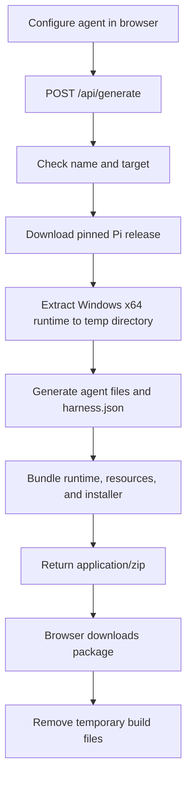

# Packy

**Your agent. Packaged.**

Packy turns an agent configuration into an installable runtime package. Configure an agent's model, tools, skills, rules, and prompts, then bundle those resources with the [Pi](https://github.com/earendil-works/pi) runtime and an installer.

Instead of sending someone a setup guide and a folder of configuration, you can give them one package to install.

> **Packy is an early-stage MVP.** The current generator implements Windows x64 packaging. macOS and Linux support, working MCP integrations, a CLI, and a package registry are not shipped yet.

---

## What Packy is

A specialized agent depends on more than a prompt. Its behavior is shaped by the runtime, model settings, tools, skills, rules, and commands surrounding it. Recreating that environment on another machine can mean repeating setup steps and copying files by hand.

Packy treats the environment as a **build artifact**.

```text
Agent definition
  ├── Model and thinking settings
  ├── Built-in tool selection
  ├── Rules and system instructions
  ├── Skills and prompt commands
  └── Runtime
          │
          ▼
    Packy generator
          │
          ▼
  Versioned-style ZIP artifact
  ├── Pi runtime
  ├── Agent resources
  ├── Package metadata
  └── Installer and launcher
          │
          ▼
      Install and run
```

Packy is not a new agent runtime and does not modify Pi's core. Pi is the first runtime Packy packages; the longer-term product direction is a reproducible way to define, build, and distribute agent environments.

## What works today

- **Web-based builder** — configure an agent through a multi-step interface.
- **Agent configuration** — set the name, description, model, thinking level, built-in tools, rules, skills, and prompt commands.
- **Runtime bundling** — the generator downloads the pinned Pi v1.0.4 Windows x64 release and includes it in the package.
- **Generated resources** — creates the agent settings, system instructions, skill files, prompt files, and package metadata.
- **Windows installer** — packages an `install.cmd` script that installs the environment under the current user's profile and creates a launcher.
- **Per-agent configuration directory** — the launcher sets `PI_CODING_AGENT_DIR` so the packaged agent's resources are kept in its own directory.
- **Direct download** — the generated ZIP is returned to the browser. The current API does not maintain a package registry or persist generated packages as a product feature.

### Platform support

| Target | Status | Notes |
| --- | --- | --- |
| Windows x64 | **Implemented** | Pi v1.0.4 binary and `install.cmd` are bundled. |
| macOS Intel (x64) | Not implemented | A target is represented in the code, but runtime download/extraction is not implemented in the generator. |
| macOS Apple Silicon (arm64) | Not implemented | A target is represented in the code, but runtime download/extraction is not implemented in the generator. |
| Linux | Not implemented | No Linux packaging flow is implemented. |

The current working path is **Windows x64**. Do not treat the other platform choices as supported until their full build and install flows have been implemented and tested.

## Quick start

### Requirements

- Node.js 20.9 or newer
- npm
- An internet connection from the machine running Packy, so the generator can download the pinned Pi release from GitHub

### Run locally

```bash
git clone https://github.com/KrishCodesw/Packy.git
cd Packy
npm ci
npm run dev
```

Open [http://localhost:3000](http://localhost:3000).

1. Configure the agent in the builder.
2. Select **Windows x64** as the target platform.
3. Review the configuration and generate the package.
4. Save the downloaded ZIP.
5. Extract it and run `install.cmd`.

The current generation endpoint downloads Pi when a package is built, so `npm run prepare:pi` is **not required** for this flow. The repository still contains that Windows-oriented helper for preparing local runtime caches, but the current API path uses on-demand runtime download.

### Production build

```bash
npm run build
npm run start
```

The generator uses Node.js APIs and temporary filesystem storage. A deployment must allow outbound requests to GitHub and provide enough memory, writable temporary disk, and execution time to download the runtime and assemble the ZIP. The bundled Windows x64 Pi release archive is approximately 45 MB before packaging.

## Build flow

The current implementation follows this path:



The package is assembled for the selected target; it is not a running hosted agent. After installation, the bundled Pi executable runs locally on the user's machine.

## What a generated package contains

A generated archive has this shape:

```text
<agent-name>.zip
├── install.cmd
├── README.md
├── harness.json
├── runtimes/
│   └── windows-x64/
│       └── pi.exe and runtime files
└── agent/
    ├── settings.json
    ├── mcp.json
    ├── SYSTEM.md
    ├── skills/
    │   └── <skill-name>/
    │       └── SKILL.md
    └── prompts/
        └── <prompt-name>.md
```

| File or directory | Purpose |
| --- | --- |
| `harness.json` | Package metadata, agent name, pinned Pi version, model, thinking level, and target platform. |
| `runtimes/windows-x64/` | The selected Pi runtime bundled with the generated package. |
| `agent/settings.json` | Default model, thinking level, selected built-in tools, and resource paths. |
| `agent/SYSTEM.md` | Agent identity, description, and operating rules. |
| `agent/skills/` | Skill Markdown files generated from the configured skill names and descriptions. |
| `agent/prompts/` | Prompt command files generated from the configured prompt names, descriptions, and bodies. |
| `agent/mcp.json` | MCP configuration placeholder output; real server integration is not implemented yet. |
| `install.cmd` | User-level installer that places the package and creates a command launcher. |

## Install and run

On Windows:

1. Extract the downloaded ZIP.
2. Run `install.cmd`.
3. Open a **new terminal** so the updated user PATH is loaded.
4. Run the generated agent command. The command is based on the agent name; for example, an agent named `Security Reviewer` becomes `security-reviewer`.

The current installer places files under:

```text
%USERPROFILE%\.harness-builder\
├── harnesses\
│   └── <agent-name>\
└── bin\
    └── <agent-name>.cmd
```

The launcher points Pi to that package's `agent/` directory using `PI_CODING_AGENT_DIR`. This keeps each package's agent resources separate from other packaged environments and from a separately installed Pi setup.

> **Brand migration note:** some generated metadata, the npm package name, and the install directory still use the previous “Harness Builder” naming. The product/repository name is Packy, but those implementation identifiers have not all been renamed yet.

### Credentials and external services

Packy does **not** bundle API keys, provider credentials, or secrets. Before running an agent, configure the credentials required by the selected model provider using the mechanism supported by Pi. Keep secrets out of agent rules, prompts, package files, and source control.

The generated package can include a runtime and agent resources, but it cannot eliminate external requirements such as model-provider access, network connectivity, or credentials for services the agent uses.

## Configuration model

The generator accepts a JSON object equivalent to the `HarnessInput` type in `lib/harness.ts`.

Example request:

```json
{
  "name": "Security Reviewer",
  "description": "Reviews code for correctness and common security issues.",
  "model": "anthropic/claude-sonnet-4",
  "thinking": "medium",
  "tools": ["read", "grep", "find", "ls"],
  "mcp": ["github"],
  "skills": [
    {
      "name": "Code Review",
      "description": "Review changes for correctness, maintainability, and common security issues."
    }
  ],
  "rules": "Never expose secrets.\nAsk before destructive operations.\nPrefer small, verifiable changes.",
  "prompts": [
    {
      "name": "review",
      "description": "Review the current changes",
      "body": "Review the current changes and report correctness risks and missing tests."
    }
  ],
  "targetPlatform": "windows-x64"
}
```

The example describes the current input shape, not a promise that every selected capability is fully integrated. In particular, the current UI offers a fixed list of MCP names, but the generated `mcp.json` uses placeholder URLs under `example.invalid`. Those entries will not connect to real MCP servers.

## API

### `POST /api/generate`

Accepts a JSON `HarnessInput` request and returns the generated ZIP.

**Successful response**

- HTTP `200`
- Content type: `application/zip`
- `Content-Disposition` includes the generated filename

**Error response**

Errors are returned as JSON with an `error` message. The current implementation uses:

| Status | Meaning |
| --- | --- |
| `400` | Missing agent name or an invalid/unrecognized target value. |
| `500` | Runtime download, extraction, package assembly, or another generation error. |

The API is an internal MVP interface and should not yet be treated as a stable public contract.

## Development

### Scripts

| Command | Purpose |
| --- | --- |
| `npm run dev` | Start the local Next.js development server. |
| `npm run build` | Build the production application. |
| `npm run start` | Start the production server after a successful build. |
| `npm run prepare:pi` | Legacy/local helper that downloads and prepares Pi v1.0.4 runtimes in `.runtime-cache/`. It is Windows-oriented and is not required by the current on-demand API generation path. |

### Repository layout

```text
app/
├── api/
│   └── generate/
│       └── route.ts          # Generation endpoint and ZIP assembly
├── page.tsx                  # Multi-step agent builder
└── globals.css               # Application styles

lib/
├── harness.ts                # Input types and generated agent files
└── pi-runtime.ts              # Pinned Pi release download and extraction

scripts/
└── prepare-pi-runtime.mjs    # Local runtime preparation helper

.runtime-cache/               # Local runtime cache; git-ignored
```

### Stack

- [Next.js](https://nextjs.org/) 16
- [React](https://react.dev/) 19
- TypeScript
- [yazl](https://github.com/thejoshwolfe/yazl) for ZIP creation
- [adm-zip](https://github.com/cthackers/adm-zip) for ZIP extraction

## Known limitations and safety notes

- **Only Windows x64 generation is implemented.** The macOS target definitions and installer code are not evidence of working macOS support.
- **MCP selection is a stub.** The generated server URLs are placeholders; real endpoints, authentication, and secret handling need to be implemented.
- **Skills are scaffolds.** The current builder generates a skill file from each skill's name and description; there is no remote skill registry or dependency resolver.
- **No registry or publishing flow yet.** Packages are downloaded from the current build request. Versioned package discovery, a Packy CLI, reproducible builds, and a marketplace are future work.
- **No Packy-level signature or checksum yet.** Generated packages contain an executable runtime. Browsers and endpoint protection may warn about downloaded archives containing executables, especially when a download source has little reputation. Verify that you trust the source and inspect what you run; do not disable security protections just to bypass a warning.
- **Builds depend on GitHub availability.** The current API fetches the pinned upstream Pi release on demand instead of serving from a managed runtime mirror.
- **Generated installer paths still use legacy naming.** The `.harness-builder` directory and other old identifiers will be migrated separately.
- **Automated tests are not yet documented in this repository.** At minimum, run `npm run build` before proposing a change.

## Roadmap

The following are possible next steps, not shipped features:

- Complete and test packaging for macOS and Linux.
- Replace MCP placeholders with validated server definitions and a secure way to supply credentials.
- Introduce a declarative Packy package specification that can be built from the CLI as well as the web UI.
- Add package validation, integrity checks, signatures, and reproducible builds.
- Add a registry for installing and publishing versioned agent packages.
- Support reusable components such as skills, prompts, tools, and complete agent environments.

The goal is to make an agent environment something developers can build, distribute, and install—not a setup procedure they must repeat.

## Licensing and attribution

The repository does not currently include a license file for Packy's own source code. Do not assume Packy's code is released under an open-source license until one is added.

The Pi v1.0.4 upstream release declares the [MIT License](https://github.com/earendil-works/pi/blob/v1.0.4/LICENSE). Pi remains a separate project with its own license and attribution requirements. Before distributing generated packages publicly, ensure the required upstream license notice is included with the bundled runtime and choose and document a license for Packy's own code.

---

**Packy — Your agent. Packaged.**
